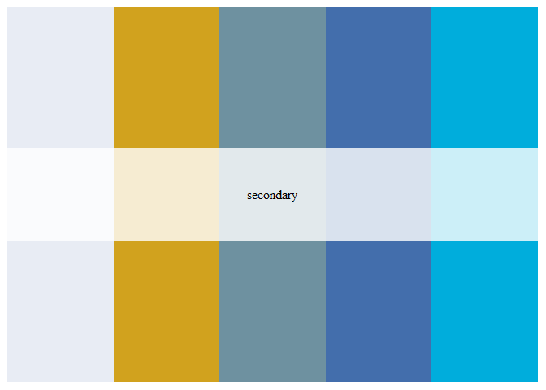
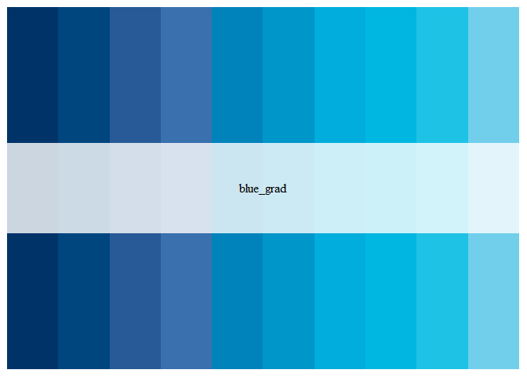

<!-- README.md is generated from README.Rmd. Please edit that file -->

# oebrand

<!-- badges: start -->

<!-- badges: end -->

This package provides Oxford Economics brand tools, including several
color palettes.

## Installation

You can install this package from [GitHub](https://github.com/) with:

``` r
# install.packages("devtools")
devtools::install_github("TourismEconomics/oebrand")
```

## Usage

``` r
library("oebrand")
# See all palettes
names(oe_palettes)
#> [1] "primary"   "secondary" "blue_grad" "bold"      "pale"
```

## Palettes

### primary

``` r
oe_palette("primary")
```


``` r
names(oe_palette("primary"))
#> [1] "prime_blue"   "prime_grey"   "prime_ltgrey" "prime_white"
```

### secondary

``` r
oe_palette("secondary")
```



``` r
names(oe_palette("secondary"))
#> [1] "sec_grey"   "sec_must"   "sec_aqua"   "sec_blue"   "sec_brblue"
```

### blue\_grad

``` r
oe_palette("blue_grad")
```



``` r
names(oe_palette("blue_grad"))
#>  [1] "blue_grad_1"  "blue_grad_2"  "blue_grad_3"  "blue_grad_4"  "blue_grad_5" 
#>  [6] "blue_grad_6"  "blue_grad_7"  "blue_grad_8"  "blue_grad_9"  "blue_grad_10"
```

### bold

``` r
oe_palette("bold")
```


``` r
names(oe_palette("bold"))
#> [1] "bold_blue"    "bold_ltblue"  "bold_grey"    "bold_red"     "bold_mustard"
#> [6] "bold_green"   "bold_orange"  NA
```

### pale

``` r
oe_palette("pale")
```


``` r
names(oe_palette("pale"))
#> [1] "pale_blue"    "pale_midblue" "pale_ltblue"  "pale_grey"    "pale_midgrey"
#> [6] "pale_ltgrey"  "pale_mustard" "pale_dkbeige" "pale_beige"
```
